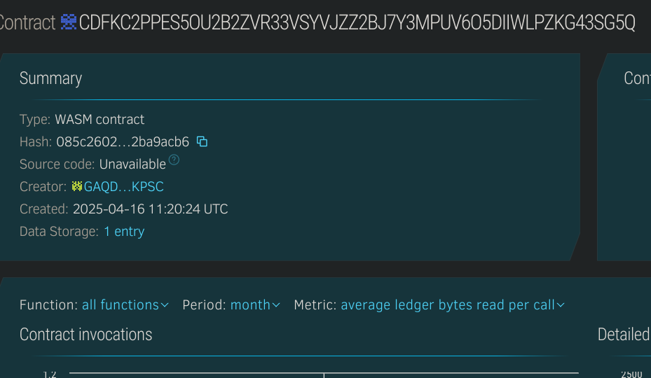

# Maintenance Request Logger

## 🧠 Project Description
The Maintenance Request Logger is a decentralized application (dApp) that enables users, tenants, or property owners to submit, track, and update maintenance requests transparently on the blockchain. It ensures tamper-proof logs and accountability for service resolution.

## 🎯 Project Vision
To bring transparency and traceability to property and equipment maintenance through decentralized logs, reducing miscommunication and ensuring faster, trusted resolutions.

## 🔑 Key Features
- 📝 Submit maintenance requests with descriptions
- 📍 Track request status (open, in-progress, resolved)
- 🔐 Owner-only status updates
- 🕓 Timestamped request logs

## 🚀 Future Scope
- Attach images or document hashes for proof
- Notifications on status changes
- Multi-role support (tenant, technician, admin)
- Rating and feedback system post-resolution

## 📦 Tech Stack
- Soroban Smart Contracts (Rust)
- Stellar Blockchain
- Soroban SDK and CLI tools

## Contract Details
CDFKC2PPES5OU2B2ZVR33VSYVJZZ2BJ7Y3MPUV6O5DIIWLPZKG43SG5Q
